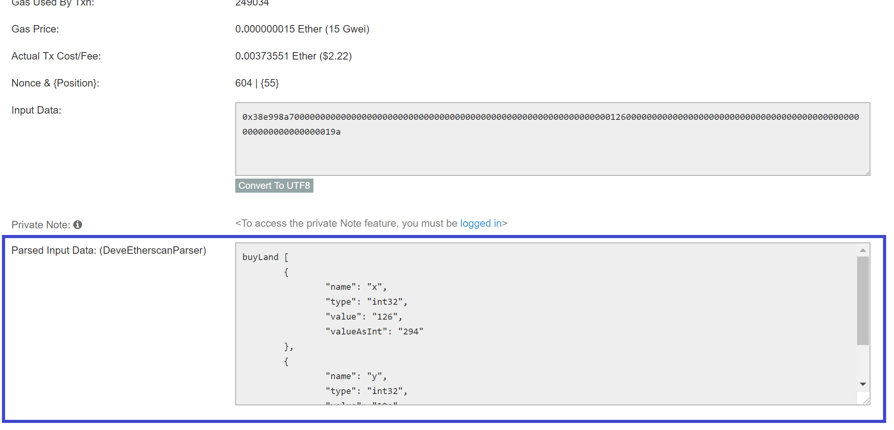
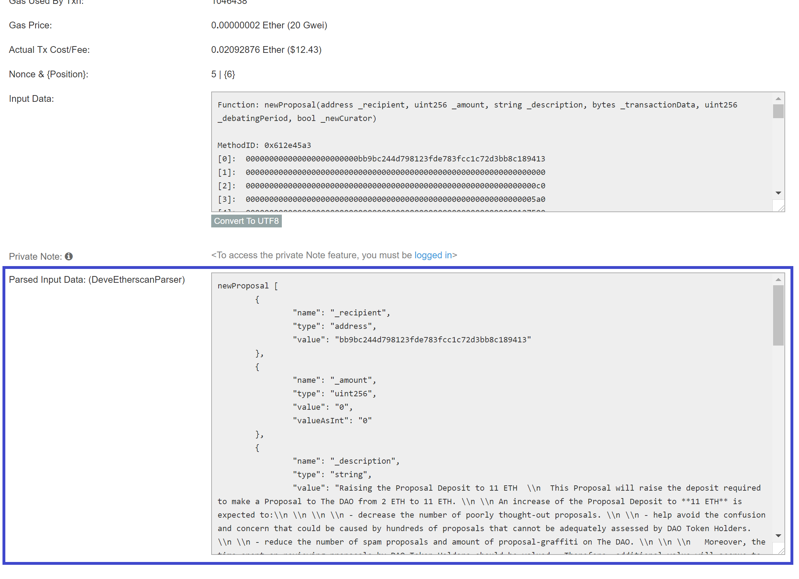

# DeveEtherscanParser
This TamperMonkey script parses the transaction input data based on provided ABI's

Use script.js for a version that can either parse by providing an ABI or can parse values based on the input parameters detected by etherscan

Use script_Old.js for a basic version that just parses integer values

# Demo

Demo parsing based on provided ABI (This should be used when only the ABI is known but not the full source)

https://etherscan.io/tx/0x90d237c27104e090a007ea87caf6aebab54637bc278a714d260e5d72b3a1f02b



Demo parsing based on parsed function name + arguments within Etherscan itself (this works when the Contract source has been uploaded to Etherscan)

https://etherscan.io/tx/0x3a7d091970d7931dd5ef4872e59093234e132f861139403d2b69db80ac2d0ecb



# Adding an ABI to the project

Within the source code find the following line of code:

```
this.abis.push(......);
```

Add a new line here where the ...... should be replaced by the ABI.
